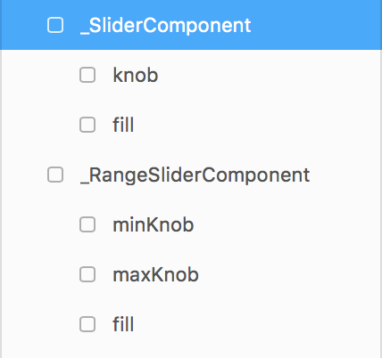
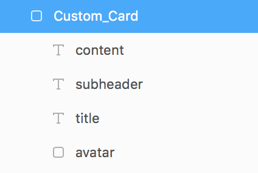
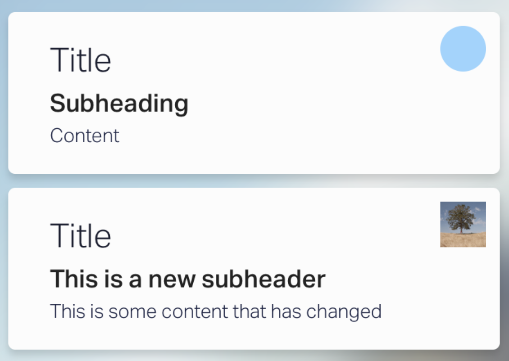
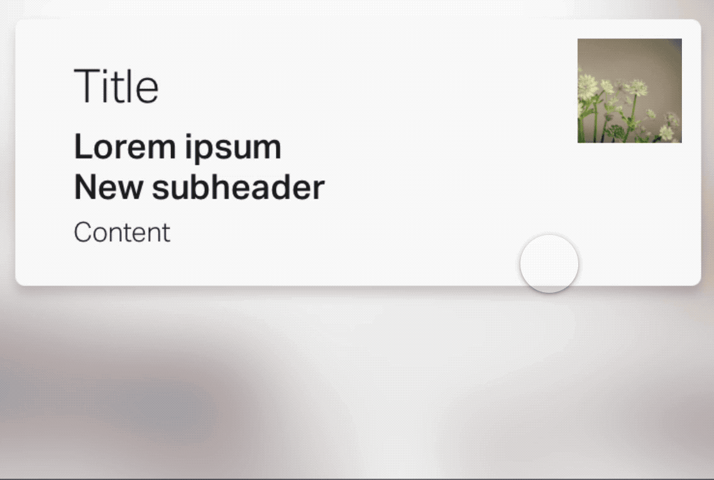
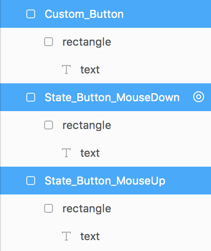
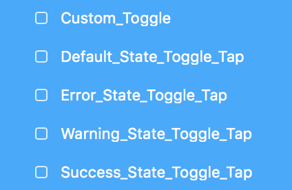

# framer-DesignComponents
A module for converting your designs in design mode into full scalable classes.

**Supported native components:**

* SliderComponent
* RangeSliderComponent


### Links

* [Installation](#installation)
* [Native components](#native-components)
* [Custom classes](#custom-classes)
* [Constraints](#constraints)


## Installation

Download and move the <code>Constraints.coffee</code> and <code>DesignComponents.coffee</code> files to your modules folder.

At the top of your file, place this line of code:

```coffeescript
Design = require "DesignComponents"
```

Done! That is all the code you need to do to get this module started. Now onto the fun stuff.


## Native components

For the native slider components, all you need to do is design a slider with the correct child names inside, and prefix the whole group with an <code>_</code>.

For example the layer structure will look like this:



The <code>_SliderComponent</code> or <code>_RangeSliderComponent</code> layers are the background fill for the slider.


## Custom classes

A custom class will be generated from your design, *including all of the layer's children*. You will then be able to add this class as many times as you want in the code view, without having to declare a class extension and constructor.

To create a custom class in design mode, simply name the layer in design mode with the following syntax:

```
Custom_{className}
```

where <code>{className}</code> is replaced by the name of your class.

For example:


**Note:** You *do not* have to create a target for these layers.


### Using your class in your prototype

To add the class to your prototype, simply create a new instance of the class as you would a layer:

```coffeescript
button = new Design.Button

card = new Design.Card
```

**The layers within your class are also accessible within the the creation of the new instance, and oyu can change their properties as oyu would any other layer in code.**

#### Card structure in Design mode



#### Editing the contents of the class in code

```coffeescript
card = new Design.Card
  avatar:
    borderRadius: 0
    image: Utils.randomImage()
  subheader:
    text: "This is a new subheader"
  content:
    text: "This is some content that has changed"
```




## Constraints

This module uses constraints by default, so you will need to include the [<code>Constraints.coffee</code>](Constraints.coffee) module otherwise it will not work.

This module duplicates the constraints that you have set in design mode, to your new class, and all of its children. So that you can resize the parent and it will reflect in the positioning and sizing of the children.

It also allows you to set up your own constraints within the code, using a simpler syntax than the native constraints.

### Setting constraints on a new layer

#### Arguments
<code>top</code> – the distance of the top edge from the top of the parent layer
<code>left</code> – the distance of the left edge from the left of the parent layer
<code>bottom</code> – the distance of the bottom edge from the bottom of the parent layer
<code>right</code> – the distance of the right edge from the right of the parent layer
<code>centerX</code> – the position of the layer within its parent on horizontal axis as a ratio between 0 - 1
<code>centerY</code> – the position of the layer within its parent on the vertical axis as a ratio between 0 - 1
<code>scaleX</code> – the width of the layer relative to its parent width as a ratio between 0 - 1
<code>scaleY</code> – the height of the layer relative to its parent height as a ratio between 0 - 1
<code>aspectRatioLocked</code> – the original ratio of width/height of the layer stays the same if set to <code>true</code>

<code>pushDown</code> - have the size of the layer affect its parent's height (best used with TextLayers)
<code>pushRight</code> - the same as <code>pushDown</code> but affecting the parent's width

```coffeescript
layer = new Layer
  size: 50

layer.constraints =
  top: null
  left: 20
  bottom: null
  right: 20
  centerX: null
  centerY: 0.5
  scaleX: null
  scaleY: 0.8
  aspectRatioLocked: true
  pushDown: true
  pushRight: null
```

In addition to an easier syntax to the Framer native constraints, you can now also add a constraint to a specific layer. i.e. if you want to have a layer always lie 10px below another layer, you can now do that, no matter what the position or size of the reference layer.

#### Arguments
<code>layer</code> – the name of the layer that you are referencing (the reference layer **must** have a <code>name</code> property)
<code>value</code> – the offset from the reference layer
<code>align</code> – align the layer to an edge on the reference layer (Default: opposite edge)

```coffeescript
reference = new Layer
  name: "reference"

layer.constraints =
  top:
    layer: "reference"
    value: 10
    align: "top"
  left:
    layer: "reference"
    value: 20
```


**Note:** Using the <code>constraints</code> property, you will have to set the constraints after the initilisation of the layer.

### Setting constraints on a layer within a custom class

If you are using a custom class from the Design mode, you can set the constraints upon initilisation.

```coffeescript
card = new Design.Card
  constraints:
    left: 10
    right: 10
  avatar:
    image: Utils.randomImage()
    constraints:
      right: 15
      top: 15
      aspectRatioLocked: true
  content:
    text: "Lorem ipsum dolor sit amet.\nNew content\nMore new content"
    constraints:
      top:
        layer: "subheader"
      pushDown: true
```

See it in action:




## States

### Single states

The syntax for adding a single state for an event is:

```
State_{className}_{event}
```

eg:



Adding multiple states for a event (toggling):

```
{stateName}_State_{className}_{event}
```

eg:



This will automatically add a switch event to the layer to switch the properties of the layer and all of its children upon the triggering of the event.